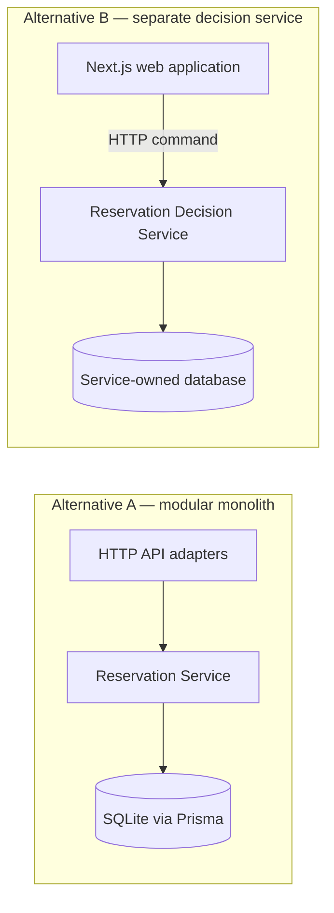
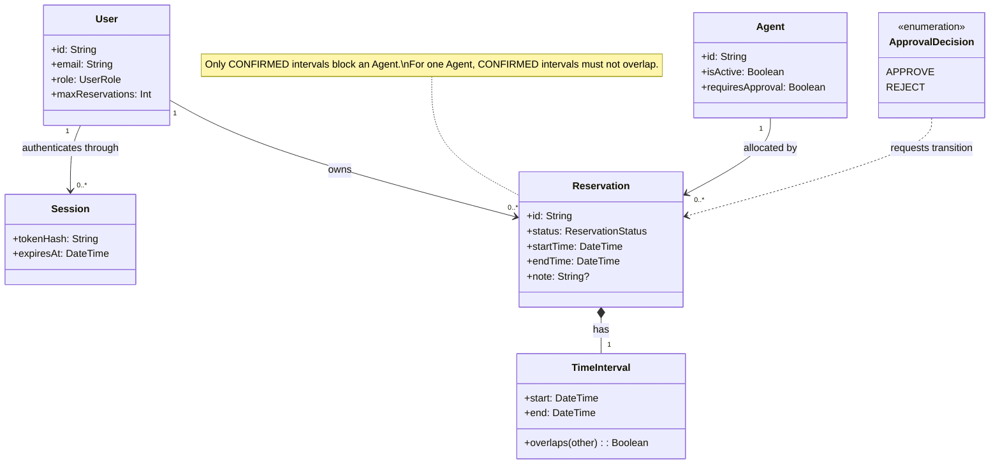
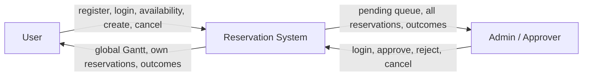
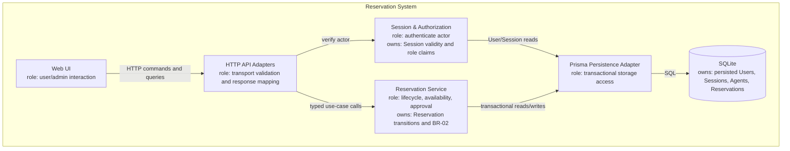
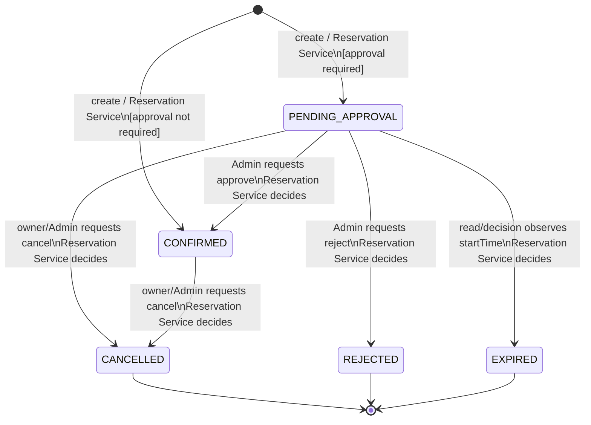
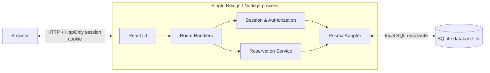
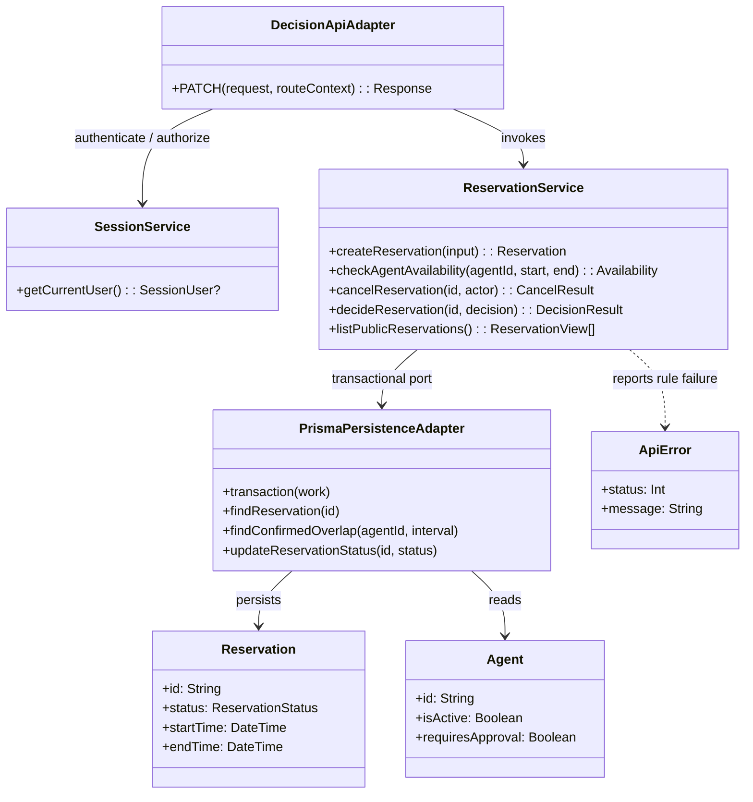

# C03 architecture diagrams

GitHub renders the Mermaid blocks below. The adjacent `.mmd` files are the
individually reusable diagram sources.

## 0. Alternatives



## 1. Domain class model



## 2. System context



## 3. Static architecture



## 4. State transition ownership



## 5. Runtime / deployment



## 6. Approve sequence

```mermaid
sequenceDiagram
  actor Admin
  participant API as Decision API Adapter
  participant Auth as Session & Authorization
  participant Service as Reservation Service
  participant DB as Prisma / SQLite

  Admin->>API: PATCH decision(APPROVE)
  API->>Auth: getCurrentUser()
  Auth->>DB: read valid Session + User role
  DB-->>Auth: ADMIN actor
  API->>Service: decideReservation(id, APPROVE)
  Service->>DB: begin transaction; load pending Reservation + Agent
  alt currentTime >= startTime
    Service->>DB: persist EXPIRED
    Service-->>API: expired result
  else overlapping CONFIRMED exists
    Service->>DB: recheck BR-02; rollback/no state change
    Service-->>API: conflict; remains PENDING_APPROVAL
  else Agent active and interval free
    Service->>DB: persist CONFIRMED; commit
    Service-->>API: confirmed result
  end
  API-->>Admin: HTTP result
```

## 7. Focused design class


