# Diagram index

All diagrams follow the accepted immediate-validation model.

Each diagram is available as Mermaid source, Graphviz DOT, SVG and PNG.

## Rozšířený use-case diagram — Baseline v0.1

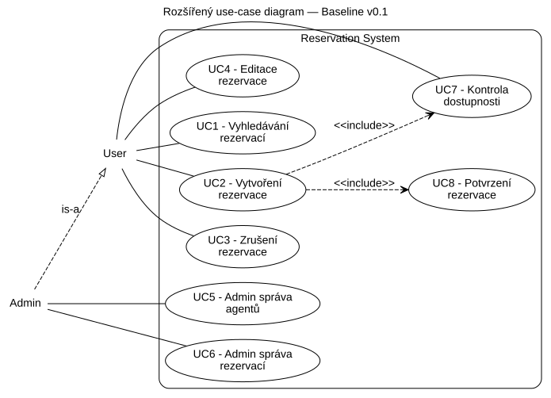

- [Mermaid](diagrams/mermaid/01-use-case-v01.mmd)
- [DOT](diagrams/dot/01-use-case-v01.dot)
- [SVG](diagrams/svg/01-use-case-v01.svg)
- [PNG](diagrams/png/01-use-case-v01.png)

## Reservation lifecycle — Baseline v0.1

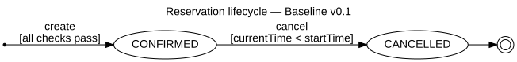

- [Mermaid](diagrams/mermaid/02-state-v01.mmd)
- [DOT](diagrams/dot/02-state-v01.dot)
- [SVG](diagrams/svg/02-state-v01.svg)
- [PNG](diagrams/png/02-state-v01.png)

## Activity — Create Reservation v0.1

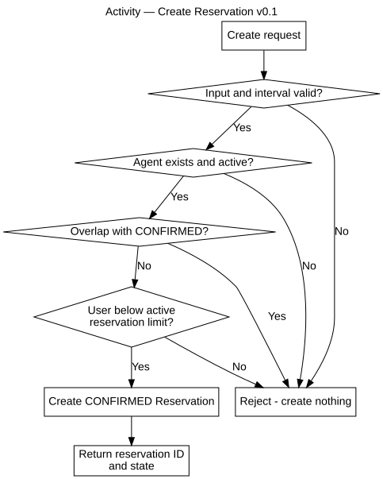

- [Mermaid](diagrams/mermaid/03-activity-create-v01.mmd)
- [DOT](diagrams/dot/03-activity-create-v01.dot)
- [SVG](diagrams/svg/03-activity-create-v01.svg)
- [PNG](diagrams/png/03-activity-create-v01.png)

## Activity — Check Availability v0.1

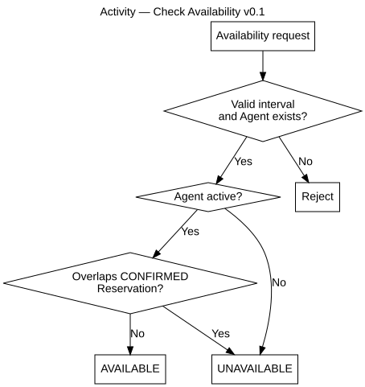

- [Mermaid](diagrams/mermaid/04-activity-availability-v01.mmd)
- [DOT](diagrams/dot/04-activity-availability-v01.dot)
- [SVG](diagrams/svg/04-activity-availability-v01.svg)
- [PNG](diagrams/png/04-activity-availability-v01.png)

## Activity — Confirm decision inside Create v0.1

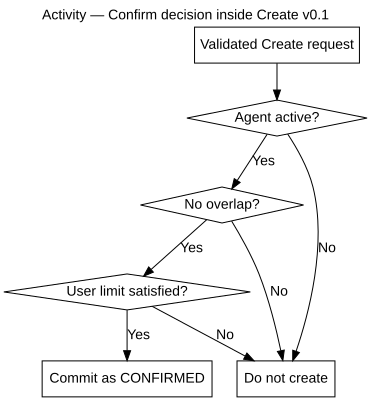

- [Mermaid](diagrams/mermaid/05-activity-confirm-v01.mmd)
- [DOT](diagrams/dot/05-activity-confirm-v01.dot)
- [SVG](diagrams/svg/05-activity-confirm-v01.svg)
- [PNG](diagrams/png/05-activity-confirm-v01.png)

## Activity — Cancel Reservation v0.1

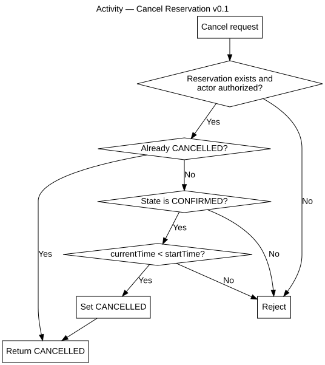

- [Mermaid](diagrams/mermaid/06-activity-cancel-v01.mmd)
- [DOT](diagrams/dot/06-activity-cancel-v01.dot)
- [SVG](diagrams/svg/06-activity-cancel-v01.svg)
- [PNG](diagrams/png/06-activity-cancel-v01.png)

## Rozšířený use-case diagram — Baseline v0.2

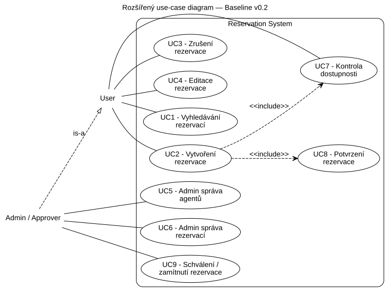

- [Mermaid](diagrams/mermaid/07-use-case-v02.mmd)
- [DOT](diagrams/dot/07-use-case-v02.dot)
- [SVG](diagrams/svg/07-use-case-v02.svg)
- [PNG](diagrams/png/07-use-case-v02.png)

## Reservation lifecycle — Baseline v0.2

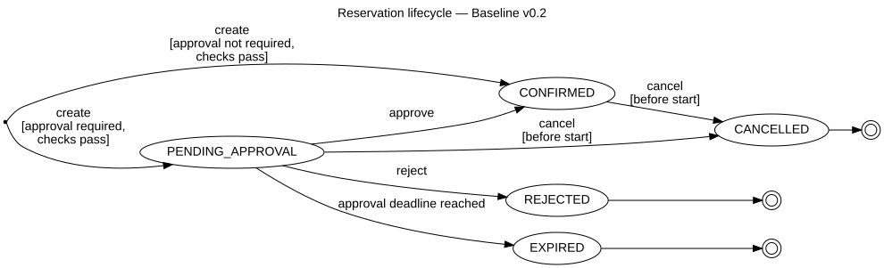

- [Mermaid](diagrams/mermaid/08-state-v02.mmd)
- [DOT](diagrams/dot/08-state-v02.dot)
- [SVG](diagrams/svg/08-state-v02.svg)
- [PNG](diagrams/png/08-state-v02.png)

## Activity — Confirmation decision v0.2

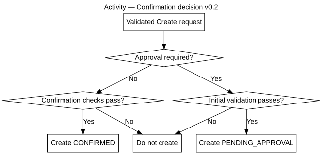

- [Mermaid](diagrams/mermaid/09-activity-confirm-v02.mmd)
- [DOT](diagrams/dot/09-activity-confirm-v02.dot)
- [SVG](diagrams/svg/09-activity-confirm-v02.svg)
- [PNG](diagrams/png/09-activity-confirm-v02.png)

## Activity — Approve / Reject Reservation v0.2

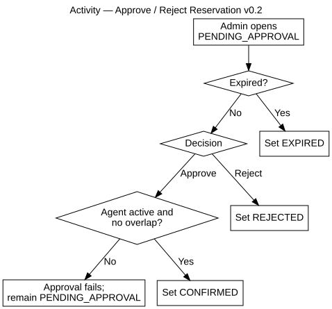

- [Mermaid](diagrams/mermaid/10-activity-approve-v02.mmd)
- [DOT](diagrams/dot/10-activity-approve-v02.dot)
- [SVG](diagrams/svg/10-activity-approve-v02.svg)
- [PNG](diagrams/png/10-activity-approve-v02.png)

## Activity — Cancel Reservation v0.2

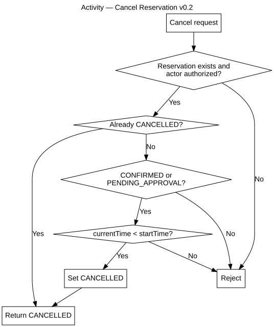

- [Mermaid](diagrams/mermaid/11-activity-cancel-v02.mmd)
- [DOT](diagrams/dot/11-activity-cancel-v02.dot)
- [SVG](diagrams/svg/11-activity-cancel-v02.svg)
- [PNG](diagrams/png/11-activity-cancel-v02.png)

## Activity — Vyhledávání / Gantt přehled rezervací v0.1

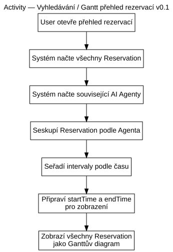

- [Mermaid](diagrams/mermaid/12-activity-search-v01.mmd)
- [DOT](diagrams/dot/12-activity-search-v01.dot)
- [SVG](diagrams/svg/12-activity-search-v01.svg)
- [PNG](diagrams/png/12-activity-search-v01.png)

## Activity — Editace rezervace v0.1

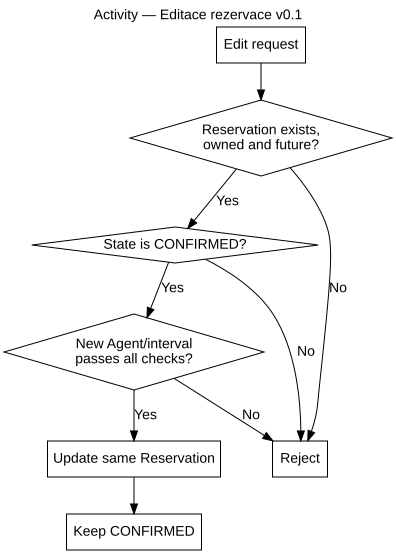

- [Mermaid](diagrams/mermaid/13-activity-edit-v01.mmd)
- [DOT](diagrams/dot/13-activity-edit-v01.dot)
- [SVG](diagrams/svg/13-activity-edit-v01.svg)
- [PNG](diagrams/png/13-activity-edit-v01.png)

## Activity — Admin správa agentů v0.1

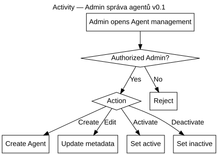

- [Mermaid](diagrams/mermaid/14-activity-admin-agents-v01.mmd)
- [DOT](diagrams/dot/14-activity-admin-agents-v01.dot)
- [SVG](diagrams/svg/14-activity-admin-agents-v01.svg)
- [PNG](diagrams/png/14-activity-admin-agents-v01.png)

## Activity — Admin správa rezervací v0.1

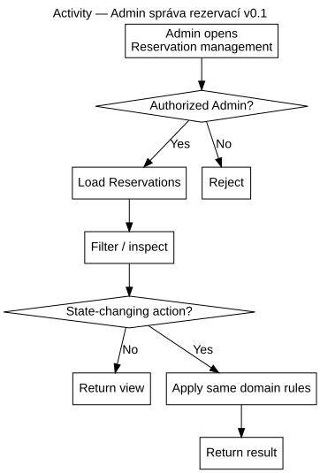

- [Mermaid](diagrams/mermaid/15-activity-admin-reservations-v01.mmd)
- [DOT](diagrams/dot/15-activity-admin-reservations-v01.dot)
- [SVG](diagrams/svg/15-activity-admin-reservations-v01.svg)
- [PNG](diagrams/png/15-activity-admin-reservations-v01.png)

## Gantt — příklad přehledu všech rezervací

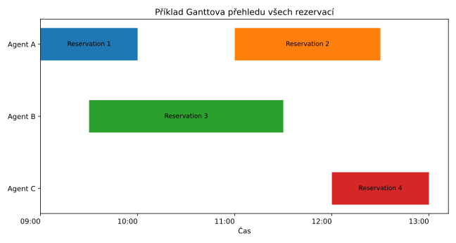

- [Mermaid](diagrams/mermaid/16-gantt-reservation-overview-example.mmd)
- [DOT](diagrams/dot/16-gantt-reservation-overview-example.dot)
- [SVG](diagrams/svg/16-gantt-reservation-overview-example.svg)
- [PNG](diagrams/png/16-gantt-reservation-overview-example.png)

